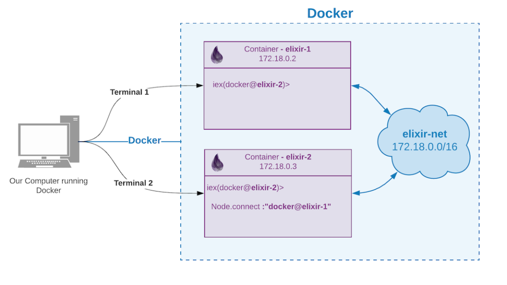

# Welcome

This project is meant to serve as a starting point for exploring [Elixir](https://elixir-lang.org) using [Docker](https://www.docker.com).

Developing [Elixir](https://elixir-lang.org) natively on your local machine appears to be a **much, much better** way to go. However, it doesn't hurt to begin experimenting and see what limitations or frustrations may present themselves.

## Getting started

The easiest way to use this repo is to have [Docker Desktop](https://www.docker.com/products/docker-desktop) installed and configured on your development machine.

Alternatively, you can still experiment with [Elixir](https://elixir-lang.org) on your development machine as well.

## Examples

This project is meant to serve as a starting point for exploring both [Elixir](https://elixir-lang.org) and Docker. I hope you enjoy exploring the examples that follow.

### Example: Phoenix Hello

This example - contained in `./example-phoenix-hello` - demonstrates how to build a simple [Phoenix](https://phoenixframework.org) application on [Elixir](https://elixir-lang.org).

Please refer to `./example-phoenix-hello/README.md` for instructions on getting started. If you already have [Docker Desktop](https://www.docker.com/products/docker-desktop) installed, you should be able to run `$ docker-compose up --build` and be off and running.

### Example: Run Elixir in multiple containers

This example - based off the original blog post [Running Elixir in Docker Containers](https://www.poeticoding.com/running-elixir-in-docker-containers/) - is intended to show how you can poke around with [Elixir](https://elixir-lang.org) and have multiple Docker containers communicate with each other.

Please refer to `./example-elixir-multiple-containers/README.md` for instructions on getting started.

